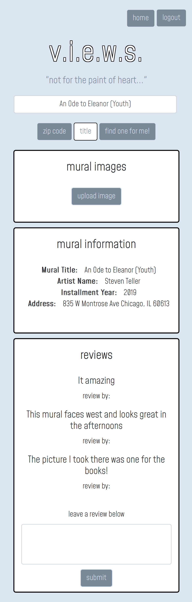
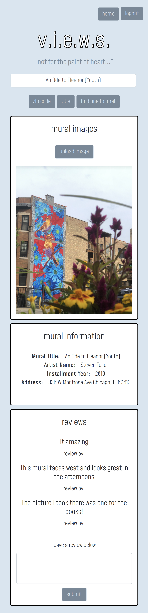
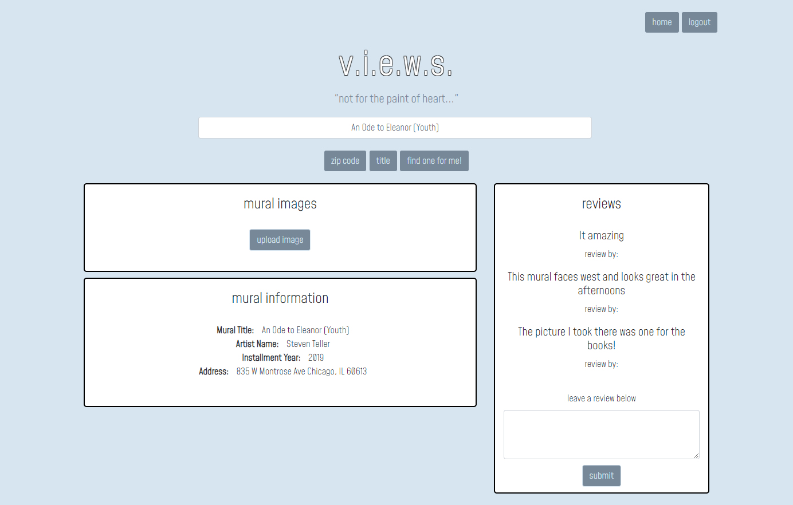
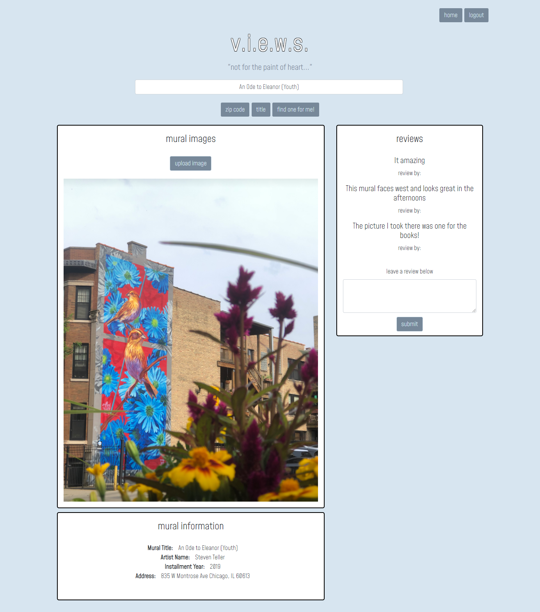

# v.i.e.w.s.

By: Jamie Capadocia, Jeffery Wojciechowski, & Sadie Sial

___


#### Table of Contents

* [Description](#description)
* [Installation](#installation)
* [Technologies](#technologies)
* [Screenshots](#screenshots)
* [Links](#links)
* [Contact](#contact)
* [License](#license)

## Description <br>

The purpose of this app is to allow art enthusiasts to interact with their community and rally around local artists who are commissioned to paint murals around the city of Chicago. At it's most basic functionality, the app will allow users to search by zip code to locate nearby murals around them, providing them with information about the mural and an address to visit it if they wish. If a user has a registered account with the app, they will have added capabilities to leave reviews about specific murals and upload images to be referenced by other registered users as well.

### User Story:

```
AS SOMEONE that is visiting the wonderful City of Chicago,
I WANT to be able to view murals around me,
SO I CAN find what the mural looks like, how to get there, the artist’s info, and when the mural was completed.

```

```
GIVEN the app is functional and properly deployed for public use

WHEN I select "Continue as guest" from the login screen
THEN I am able to search by zip code to locate nearby murals and am provided with basic information about them (this is the extent of the functionality of the app when a user is not registered)

WHEN I select "Register now" from the login screen
THEN I am able to enter my personal information to register an account for the app and and am directed to my personal profile page to access additional functionality/privileges for the app

WHEN I login with my existing credentials for my registered account from the login screen
THEN I am directed to my personal profile page to access additional functionality/privileges for the app

WHEN I am logged in and on my personal profile page
THEN I am presented with information regarding reviews that I have left on specific murals and any pictures I have uploaded as well. I am also presented with the option to search for murals by zip code, or I can search by specific mural names.

WHEN I select a specific mural (only available to registered users)
THEN I am directed to the page of the specific mural in which I can view any uploaded images by users, reviews for the mural that have been posted by users, and general information about the mural itself.

WHEN I select "Home" at the top right of the app (only available to registered users)
THEN I am directed back to my personal profile page

WHEN I select "Logout" at the top right of the app (only available to registered users)
THEN I am directed back to the login page in which thhe app will have limited functionality until I login again
```

## Installation
- As this is a full deployed app on Heroku, no installation is required to begin using the app. Simply visit <a href="https://peaked-project.herokuapp.com/">this link</a> and enjoy!

## Technologies

### The technologies used to create this program were: 
- Bcrypt
- Bulma
- Cloudinary
- Dotenv
- Express
- Handlebars
- MySql

## Screenshots

Initial Mobile Display   |  Results Mobile Display
:-------------------------:|:-------------------------:
  |  


Initial Desktop Display: 

Results Desktop Display: 

<br>

## Links

- [Heroku](https://peaked-project.herokuapp.com/)

- [GitHub Repository](https://github.com/jcapadocia3/Project-2)

- [Project Presentation](https://docs.google.com/presentation/d/1TWedlUaTuS3mvYdcD1tdsRXQGo4JOEJ4-4qVwMbBDAE/edit#slide=id.g29f43f0a72_0_0)

<br>

## Contact

Team G.A.F is:
[Jamie Capadocia](https://github.com/jcapadocia3) +
[Jeffery Wojciechowski](https://github.com/Jefferywojo98) + 
[Sadie Sial](https://github.com/sadielinks)

## License

This source code is available to everyone under the standard [MIT license ©](https://choosealicense.com/licenses/mit/) <br><br>
© 2021 Trilogy Education Services, LLC, a 2U, Inc. brand. Confidential and Proprietary. All Rights Reserved.
